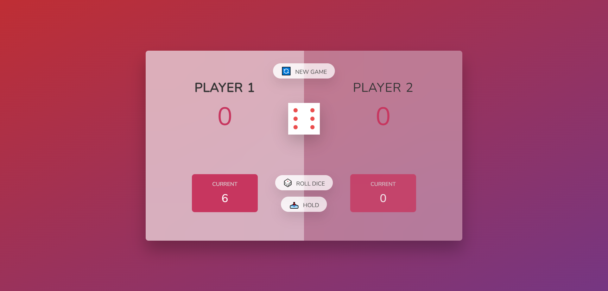

# Dice Game 🎲 (Vanilla JavaScript)

🔗 **Live Demo:** (https://pig-game-js-w-j.netlify.app/)

A fun **two-player dice game** built using **vanilla JavaScript**.  
Players take turns rolling a dice, accumulating points, and trying to be the first to reach **100 points** to win. Perfect for learning DOM manipulation and interactive game logic.

---

## 🚀 Features

- **Two Player Gameplay**
  - Two players can play simultaneously
  - Players take turns rolling the dice

- **Dice Roll Mechanics**
  - Roll a dice to accumulate points
  - Rolling a 1 switches the turn to the next player

- **Hold Feature**
  - Players can hold their current score to add it to their total score
  - Strategic choice: risk rolling again or secure points

- **Win Condition**
  - First player to reach **100 points** wins the game
  - Winner is visually highlighted

- **Game Reset**
  - Start a new game at any time using the **New Game** button

---

## 🎯 Project Purpose

This project was built to:

- Strengthen core **JavaScript fundamentals**
- Improve performance-focused front-end development skills

---

## 🧠 JavaScript Concepts Used

- DOM selection and manipulation
- Event handling (`click` events)
- Conditional logic (`if / else`)
- Function abstraction for reusable logic (`init`, `switchPlayer`)
- Random number generation (`Math.random`)
- Class manipulation (`classList.add`, `classList.remove`, `classList.toggle`)
- State management with variables

---

## 🛠 Tech Stack

- **HTML5**
- **CSS3**
- **Vanilla JavaScript (ES6)**

---

## 🎯 How to Play

1. Both players start with **0 points**
2. Click **Roll Dice** to roll the dice
3. If you roll **1**, your turn ends and the next player rolls
4. Click **Hold** to save your current score to your total
5. First player to reach **100 points** wins the game
6. Click **New Game** to reset and start over

---

## 📷 Preview

---

## 👨‍💻 Author

**Md. Asaduzzaman Rana**  
Front-End Developer  
Front-End Developer (React • Next.js • JavaScript)
